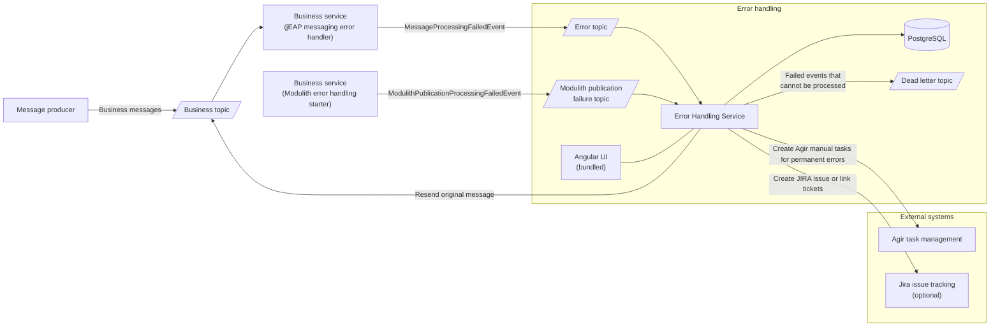
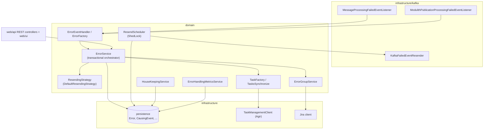
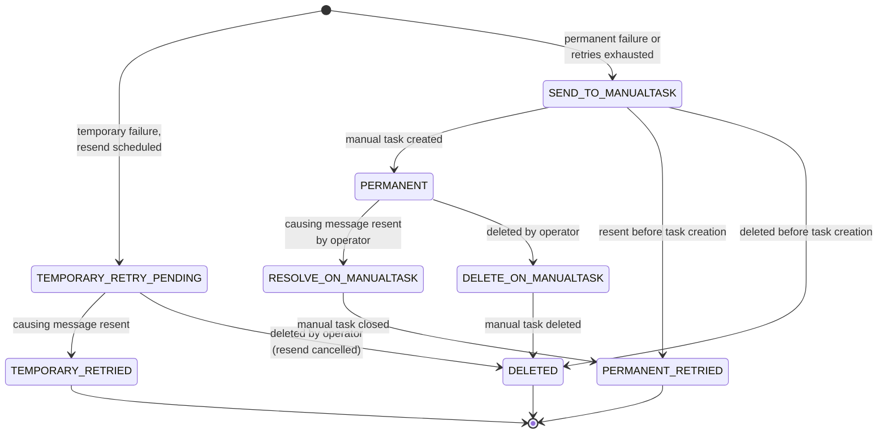
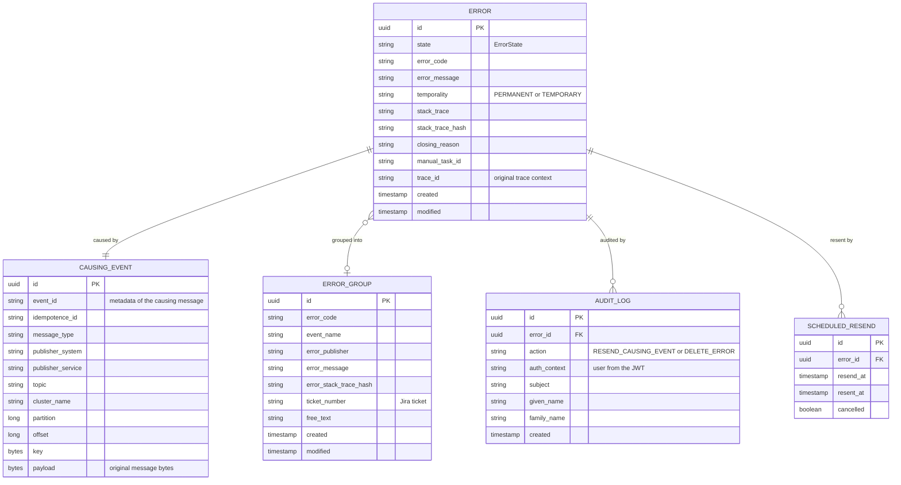

# Architecture

The jEAP Error Handling Service (EHS) is a self-contained system that handles failed Kafka messages and
Spring Modulith event publications. Business services never retry failed Kafka messages
themselves: the [jEAP messaging error handler](https://jeap-admin-ch.github.io/docs/jeap-messaging/) wraps the
failed message into a `MessageProcessingFailedEvent` and publishes it to an error topic. The EHS consumes
that topic, persists the failure, retries temporary errors, escalates permanent errors to manual tasks, and
offers a UI to inspect, resend and close errors. Services using the Modulith error handling starter report
exhausted publications to a separate Modulith publication failure topic and receive retry or discard commands from
the EHS.

## Goals and constraints

- **No message is ever lost.** Every message that cannot be processed ends up either persisted in the EHS or,
  if even the EHS cannot process it, on a dedicated dead letter topic.
- **One EHS instance per business system.** The EHS is published as a library; every system creates its own
  deployable instance (see [Getting Started](getting-started.md)).
- **Retries are the responsibility of the EHS**, not of the consuming services. Consumers classify failures
  as temporary or permanent; the EHS schedules resends for temporary failures.

## Context

## Building blocks

| Module                                 | Description                                                                                                                              |
|----------------------------------------|------------------------------------------------------------------------------------------------------------------------------------------|
| `jeap-error-handling-service`          | Spring Boot backend with all domain and infrastructure logic, published as a library. The built Angular UI is served from its classpath. |
| `jeap-error-handling-ui`               | Angular frontend. Built with npm/`ng build` during the Maven build and packaged as static resources.                                     |
| `jeap-error-handling-service-instance` | Thin `pom`-packaging parent used by the per-system instance repositories.                                                                |

Inside `jeap-error-handling-service` the main components are:

## Error state model

The central entity is the `Error` with its `ErrorState`, which drives the entire lifecycle. Temporary
failures are retried automatically; permanent failures create a manual task and wait for an operator.

A message whose processing fails again after a resend simply produces a new `MessageProcessingFailedEvent`,
i.e. a new `Error` for the same causing event. The `ResendingStrategy` sees the error count per causing event
and escalates a temporary error to a permanent one once the maximum number of retries is reached.

The intermediate states `SEND_TO_MANUALTASK`, `RESOLVE_ON_MANUALTASK` and `DELETE_ON_MANUALTASK` decouple the
state changes from the availability of the task management service: if Agir cannot be reached, the scheduled
`TasksSynchronize` job picks the errors up later and completes the transition.

For a manual retry or discard of a Modulith publication, the command outbox entry and the corresponding
`RESOLVE_ON_MANUALTASK` or `DELETE_ON_MANUALTASK` state are committed in one database transaction. The external
manual task is closed only by a later `TasksSynchronize` run, after that transaction has committed. Kafka-origin
actions retain their synchronous manual-task close attempt.

## Data model

The causing message is stored exactly as it was read from Kafka (key and payload as byte arrays), so it can
be republished unchanged, even if it could not be deserialized in the first place.

## Deployment view

The EHS runs as a standard jEAP Spring Boot microservice. All scheduled jobs — `ResendScheduler`,
`HouseKeepingScheduler`, `TasksSynchronize` and the metrics sampling — use ShedLock with a JDBC lock
provider, so multiple instances can run in parallel and each job executes on exactly one instance.

Production uses PostgreSQL with Flyway migrations; integration tests run against H2.

## Related

- [Message Flows](message-flows.md) — sequence diagrams of the runtime behaviour
- [MessageProcessingFailedEvent](message-processing-failed-event.md) — the inbound event contract
- [Configuration](configuration.md) — all configuration properties
- [Error Groups](error-groups.md) — grouping of permanent errors and Jira integration
