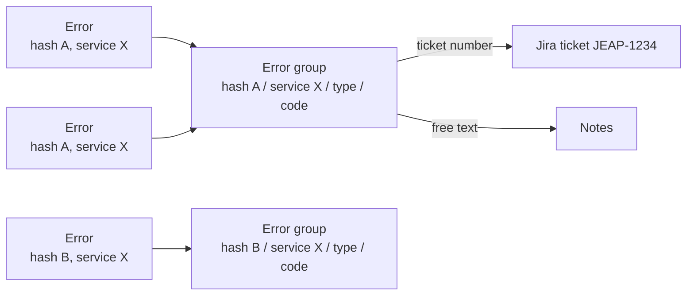

# Error Groups

Error groups aggregate permanent errors that share the same root cause, so that operators see one entry per
problem instead of hundreds of individual errors, and can attach a ticket to the problem as a whole.

## Grouping

The jEAP messaging error handler computes a **stack trace hash** over the stack trace elements of the
exception that caused the failure and embeds it in the `MessageProcessingFailedEvent` (variable stack trace
parts can be excluded via patterns, see the jEAP messaging documentation on error stack trace hashing).
Two errors with the same hash failed at the same code location and describe the same problem.

The EHS groups permanent errors by the combination of:

- stack trace hash,
- publishing service,
- message type, and
- error code.

Only errors in the states `PERMANENT` and `SEND_TO_MANUALTASK` count towards a group — deleted errors and
errors currently in a retry are not counted. Grouping can be disabled with
`jeap.errorhandling.error-groups.errorGroupingEnabled=false`.

## Additional information on a group

An error group carries two editable fields:

- a **free text** for notes, and
- a **Jira ticket number**. With a configured `jeap.errorhandling.frontend.ticketingSystemUrl` the UI links
  from the group directly to the ticket.

With a configured [Jira integration](configuration.md#jira-issue-tracking), the EHS can also **create** a
Jira ticket for a group directly from the UI: the summary is built from a configurable template, and the
description contains a table with the key data of the group including a link back to the EHS.

The error list view offers a "no Jira ticket" filter to show only errors whose group has no ticket assigned
yet, see [User Interface](user-interface.md#error-list).

## Roles

Viewing and editing error groups requires roles on the `errorgroup` resource:

| Role                             | Allows                                                 |
|----------------------------------|--------------------------------------------------------|
| `<systemname>_@errorgroup_#view` | Viewing error groups (required to use the group view). |
| `<systemname>_@errorgroup_#edit` | Saving free text and Jira ticket number.               |

## Default sorting

The default sorting of the error group view is configurable; a user's locally persisted sorting takes
precedence over the configured default:

| Property                                             | Description                              | Default         |
|------------------------------------------------------|------------------------------------------|-----------------|
| `jeap.errorhandling.error-groups.default-sort-field` | Default sort column of the group view.   | `latestErrorAt` |
| `jeap.errorhandling.error-groups.default-sort-order` | Default sort direction (`ASC` / `DESC`). | `DESC`          |

## Housekeeping

The EHS housekeeping periodically deletes all error groups that have no errors assigned anymore, see
[Operations](operations.md#housekeeping).

## Related

- [User Interface](user-interface.md) — group view and filters
- [Configuration](configuration.md#jira-issue-tracking) — Jira integration properties
