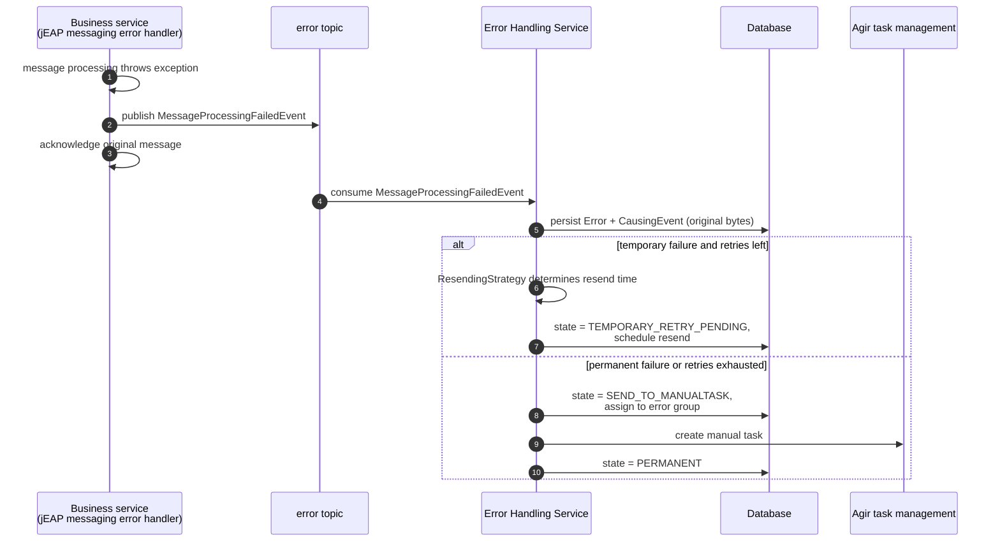
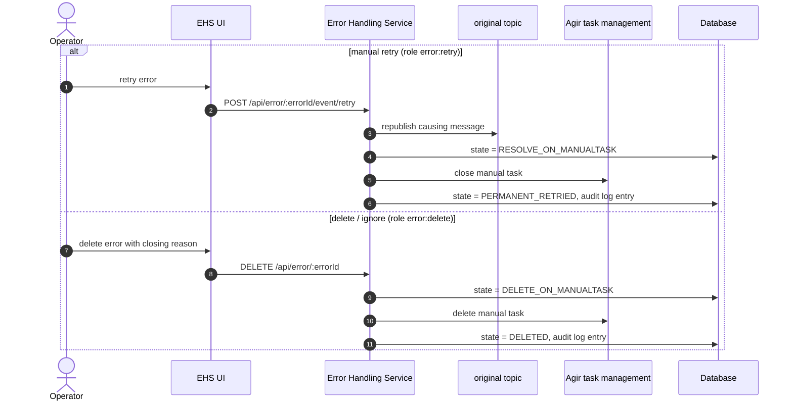
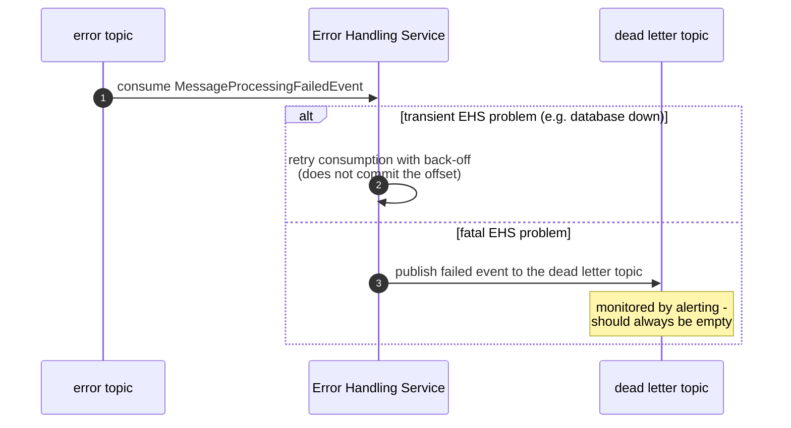

# Message Flows

This page shows the runtime behaviour of the Error Handling Service (EHS) as sequence diagrams. See
[Architecture](architecture.md) for the static structure and the error state model.

## Failed message intake

When message processing fails in a business service, the jEAP messaging error handler publishes a
`MessageProcessingFailedEvent` to the error topic and acknowledges the original message, so the consumer
is not blocked. The EHS consumes the failed event, persists the error together with the original message
bytes, and classifies it.



If the EHS itself fails to process the failed event, the classification in
`MessageProcessingFailedEventListener` decides between an in-place retry and the dead letter topic:

- transient problems (database unavailable, locks, read-only transactions) trigger a Kafka retry with a
  configurable back-off (`RecoverableEhsProcessingException`),
- fatal problems route the event to the dead letter topic (`FatalEhsProcessingException`), see
  [Operations](operations.md#dead-letter-topic).

## Automatic retry of temporary errors

```mermaid
sequenceDiagram
    autonumber
    participant Scheduler as ResendScheduler<br/>(ShedLock)
    participant DB as Database
    participant EHS as KafkaFailedEventResender
    participant Topic as original topic
    participant Consumer as Business service

    loop configured cron interval
        Scheduler->>DB: load due ScheduledResends
        Scheduler->>EHS: resend causing event
        EHS->>Topic: republish original message bytes<br/>(headers jeap_eh_target_service, jeap_eh_error_handling_service)
        EHS->>DB: state = TEMPORARY_RETRIED
    end
    Topic->>Consumer: consume message again
    alt processing succeeds
        Consumer->>Consumer: business process continues
    else processing fails again
        Consumer->>EHS: new MessageProcessingFailedEvent
        Note over EHS: new Error for the same causing event;<br/>the ResendingStrategy escalates to a permanent<br/>error once max-retries is reached
    end
```

The message is republished to the cluster it was originally consumed from (see
[Operations](operations.md#multi-cluster-support)). The header `jeap_eh_target_service` allows other
consumers of the same topic to ignore messages that are resent for a different service.

## Manual retry and delete from the UI

Operators with the corresponding roles can manually resend or close permanent errors in the UI. Both
actions are recorded in the audit log with the acting user from the JWT token.



If Agir is unavailable, the state remains at `RESOLVE_ON_MANUALTASK` / `DELETE_ON_MANUALTASK` and the
scheduled `TasksSynchronize` job completes the transition later.

## Error handling of the Error Handling Service itself

So that no message is lost even when the EHS fails, the EHS uses the regular jEAP messaging error handling
for its own consumption — but publishing to its own error topic would create a loop. The EHS therefore
publishes its own processing failures to a dedicated dead letter topic:



## Related

- [Architecture](architecture.md) — error state model and data model
- [Configuration](configuration.md#resending) — resend strategy and retry properties
- [Operations](operations.md) — dead letter topic monitoring, housekeeping, metrics
