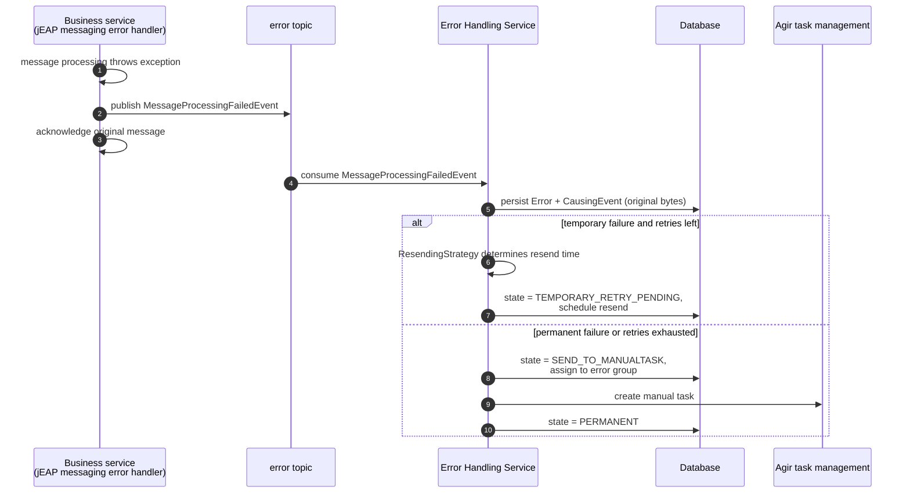
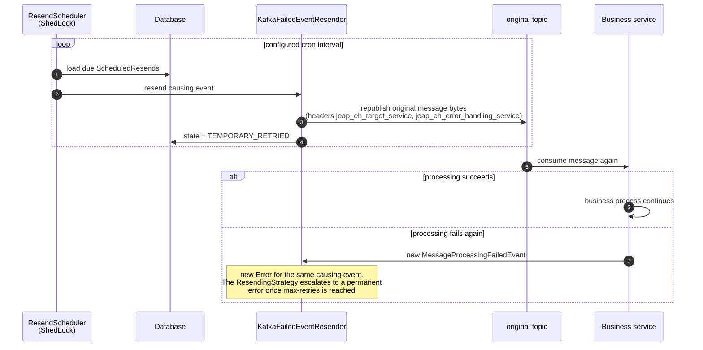
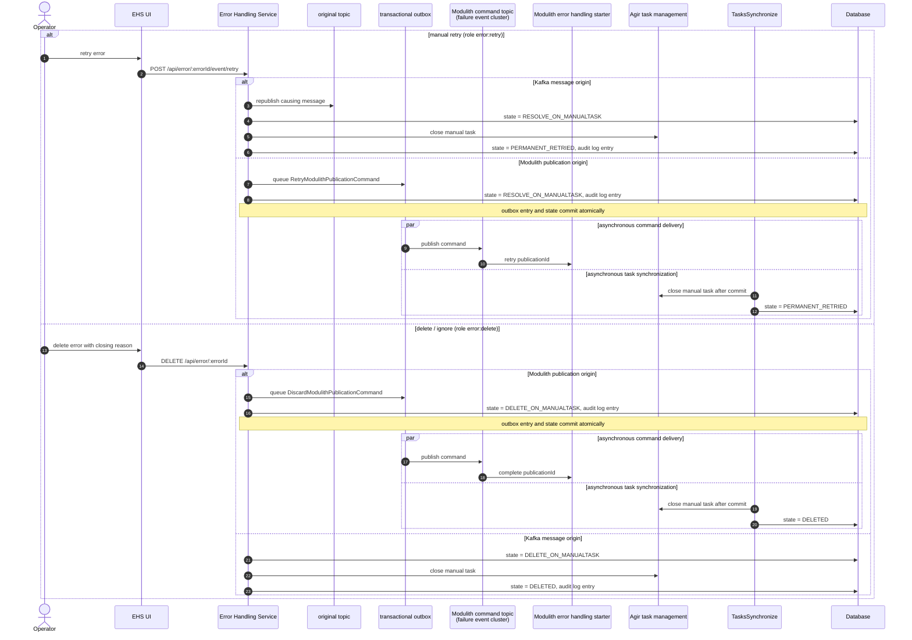
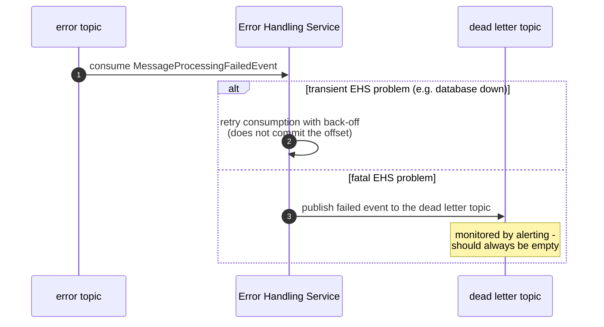

# Message Flows

This page shows the runtime behaviour of the Error Handling Service (EHS) as sequence diagrams. See
[Architecture](architecture.md) for the static structure and the error state model.

## Failed message intake

When message processing fails in a business service, the jEAP messaging error handler publishes a
`MessageProcessingFailedEvent` to the error topic and acknowledges the original message, so the consumer
is not blocked. The EHS consumes the failed event, persists the error together with the original message
bytes, and classifies it.

If the EHS itself fails to process the failed event, the classification in
`MessageProcessingFailedEventListener` decides between an in-place retry and the dead letter topic:

- transient problems (database unavailable, locks, read-only transactions) trigger a Kafka retry with a
  configurable back-off (`RecoverableEhsProcessingException`),
- fatal problems route the event to the dead letter topic (`FatalEhsProcessingException`), see
  [Operations](operations.md#dead-letter-topic).

## Failed Modulith publication intake

A service using the Modulith error handling starter publishes a
`ModulithPublicationProcessingFailedEvent` after the publication exhausts its local retry budget. The EHS
persists the publication ID, listener, internal event payload, consumed Kafka cluster, and the source service's retry
and discard command topics as a permanent error. A manual retry queues `RetryModulithPublicationCommand`; closing the
error queues `DiscardModulithPublicationCommand`. Both commands are inserted into the transactional outbox for that
same Kafka cluster in the same transaction as the EHS state change. If the cluster is no longer configured, the action
fails and the EHS error remains open rather than silently sending the command through the default cluster.

## Automatic retry of temporary errors

The message is republished to the cluster it was originally consumed from (see
[Operations](operations.md#multi-cluster-support)). The header `jeap_eh_target_service` allows other
consumers of the same topic to ignore messages that are resent for a different service.

## Manual retry and delete from the UI

Operators with the corresponding roles can manually resend or close permanent errors in the UI. Both
actions are recorded in the audit log with the acting user from the JWT token. Kafka errors resend the
stored causing message. Modulith errors publish a UUID-exact command through the transactional outbox.

For Modulith publications, the command references the ID of the consumed publication failure event. If command
enqueueing fails, the database transaction rolls back and the error remains open. If Agir is unavailable, the state
remains at `RESOLVE_ON_MANUALTASK` / `DELETE_ON_MANUALTASK` and a later `TasksSynchronize` run retries the close.

## Error handling of the Error Handling Service itself

So that no message is lost even when the EHS fails, the EHS uses the regular jEAP messaging error handling
for its own consumption — but publishing to its own error topic would create a loop. The EHS therefore
publishes its own processing failures to a dedicated dead letter topic:

## Related

- [Architecture](architecture.md) — error state model and data model
- [Configuration](configuration.md#resending) — resend strategy and retry properties
- [Operations](operations.md) — dead letter topic monitoring, housekeeping, metrics
